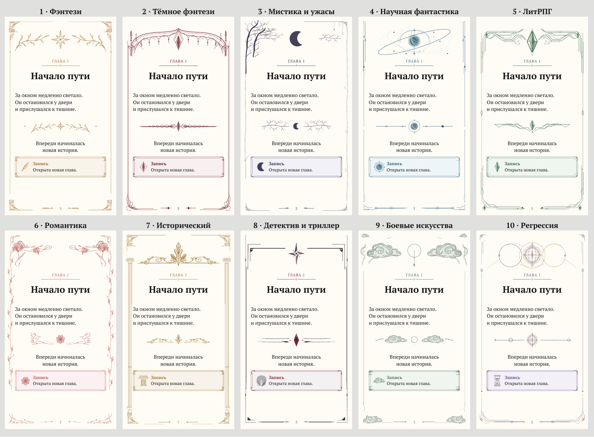

# PDFMaker Mobile

Настольное приложение (Electron) для сборки электронного издания из отдельных глав:
**PDF mobile-first**, **EPUB 3 reflowable**, **FB2**, **MOBI**, **AZW3** и **TXT**.

Исходники принимаются в форматах **TXT**, **DOCX**, **DOCX из Google Docs**,
**FB2**, **MOBI** и **AZW3 (KF8)**, а также
папками и ZIP-архивами. Исходники разбираются **один раз** в единое внутреннее
представление, из которого собираются выбранные форматы.

## Экспорт

В разделе «Вывод» отметьте нужные форматы. Можно сохранить несколько сразу.
Выбранная папка экспорта запоминается между запусками приложения; её можно сменить
кнопкой «Изменить папку…». Если выбрано больше одного формата, все файлы этой
сборки сохраняются внутри неё в папку с названием новеллы. Один формат сохраняется
прямо в выбранную папку. Повторные сборки той же новеллы используют ту же папку;
названия файлов по-прежнему содержат диапазон глав.
Во все файлы входят только включённые главы, в порядке, заданном в списке.

- **FB2**: название, автор, язык, обложка, иллюстрации, жирное и курсивное
  начертания, ссылки, списки и системные блоки. Жанровые узоры сохраняются как PNG;
  шрифты и прочее оформление выбирает читалка. Каждый файл проверяется по
  [официальной схеме FictionBook](https://github.com/gribuser/fb2).
- **MOBI**: совместимый формат для старых Kindle; оформление проще, чем в AZW3.
- **AZW3**: Kindle с оформлением и иллюстрациями.
- **TXT**: обычный текст UTF-8, названия глав и разделители сцен; без изображений.

FB2 и TXT собираются приложением самостоятельно. MOBI и AZW3 создаются
локальным [Calibre](https://calibre-ebook.com/), без передачи книги в интернет.
Приложение находит установленный Calibre или отдельный переносимый конвертер.
Для подготовки переносимого конвертера в Windows выполните один раз:

```bash
npm run kindle-tools
```

Скрипт скачивает официальный Calibre Portable 9.15.0 (около 196 МБ), проверяет
SHA-256 и цифровую подпись Kovid Goyal, распаковывает в `%USERPROFILE%\.pdfmaker`.
Для последующих сборок интернет не требуется. Альтернатива — обычная установка
[Calibre для Windows](https://calibre-ebook.com/download_windows).
Для нестандартного расположения задайте `PDFMAKER_CALIBRE` с полным путём к
`ebook-convert.exe` (на Linux/macOS — `ebook-convert`).

EPUB для Kindle создаётся временно, если его сохранение не выбрано, и удаляется
после конвертации. В отчёте доступны все готовые файлы и результаты их проверок.

## Запуск

```bash
npm install
npm start
```

Сборка установщика для Windows:

```bash
npm run dist
```

## Шрифты

По умолчанию приложение ищет PT Serif и PT Sans, а если их нет — переходит на
системные кириллические (на Windows это Georgia и Segoe UI). Чтобы получить
ровно те шрифты, которых просит спецификация:

```bash
npm run fonts
```

Скрипт кладёт PT Serif и PT Sans в `assets/fonts`. Туда же можно положить
любые `.ttf` вручную — они подхватятся автоматически.

## Что делает приложение

**Разбор исходников.** TXT читается с определением кодировки (UTF-8, Windows-1251,
KOI8-R, IBM866, UTF-16) и, если текст был свёрстан жёсткими переносами строк,
абзацы склеиваются обратно. DOCX разбирается напрямую из OOXML: абзацы,
начертания, списки, таблицы, гиперссылки и иллюстрации вместе с их положением
в тексте. Экспорт Google Docs поддерживается отдельно — у него плоская структура
и пустые абзацы между настоящими.

FB2, MOBI и AZW3 разбираются как целые книги: разделы появляются в списке глав
в исходном порядке. Сохраняются текст, заголовки, жирное и курсивное начертания,
встроенные растровые иллюстрации, обложка, автор и язык книги. Название из метаданных подставляется,
если поле названия книги пустое. FB2 также учитывает вложенные разделы и примечания.
Книги можно добавлять отдельно, из папки или ZIP (включая `.fb2.zip`).
Calibre не требуется: Kindle читается встроенным
[mobi-parser](https://github.com/hhk-png/lingo-reader), версия 0.4.6.
Защищённые DRM и повреждённые файлы отмечаются в отчёте и исключаются из сборки;
остальные исходники продолжают импортироваться. Исходное CSS электронных книг
заменяется оформлением PDFMaker; SVG-обёртки с одной растровой иллюстрацией
распознаются, самостоятельные векторные иллюстрации не поддерживаются.

**Аудит** (один проход): номера и порядок чтения, пропуски в нумерации, дубли
и разные версии одной главы, пустые и повреждённые файлы, подозрительно короткие
главы, кодировки, иллюстрации. Дубли ищутся по номеру/заголовку, затем по хешу,
и только для подозрительных совпадений сравнивается текст — попарного сравнения
всех глав со всеми не делается.

**Нормализация** только технических дефектов: битая кодировка, мусор экспорта,
лишние пустые строки, повтор заголовка в первой строке, управляющие символы.
Литературный текст, имена, реплики и авторская пунктуация не меняются.
Системные окна, чаты и панели остаются отдельными структурными элементами.

**Заголовки глав.** Номер и название из начала документа имеют приоритет перед
техническим именем файла (`CH0001.docx` и подобными). Поддерживаются заголовки
вроде «Глава 1. Название» и «48-я глава. Название», а также название в отдельном
абзаце с оформлением заголовка. Обычный первый абзац сохраняется в тексте.

**Жанровое оформление.** В разделе «Оформление» выберите один из десяти жанров:
фэнтези, тёмное фэнтези, мистика и ужасы, научная фантастика, ЛитРПГ, романтика,
исторический, детектив и триллер, боевые искусства / культивация, регрессия /
временные циклы. Образец сразу показывает выбранные узоры и цвета. Каждый
профиль задаёт векторные разделители сцен, виньетки заголовков, оформление
системных окон и обложки; PDF также получает тонкую рамку и тематические
колонтитулы. В EPUB узоры сохраняются как SVG и подстраиваются под экран.
Исходные линии из символов заменяются выбранным векторным разделителем.

**PDF.** Страница 108 × 192 мм (9:16), настраиваемые поля и кегли,
собственный наборный движок: выключка с контролем межсловных пробелов (строка
с плохой выключкой уходит влево), переносы по слогам для русского и латиницы,
контроль сирот и вдов. Кликабельное оглавление, закладки на все разделы,
настоящая Link-аннотация на страницу команды, иллюстрации без искажений,
системные блоки с фоном и рамкой, переносимые на следующую страницу.
Текст остаётся текстом: выделяется, копируется и ищется.

**EPUB 3.** Reflowable, `mimetype` первым и без сжатия, отдельный XHTML на каждый
раздел, `nav.xhtml` для интерфейса читалки **без отдельной видимой страницы
оглавления**, официальная cover-image, язык исходной книги (по умолчанию `ru`), переводчик в `dc:contributor`,
активная внешняя ссылка на команду, изображения с `max-width: 100%` и `alt`.
JavaScript не используется.

**Проверки.** После сборки выполняется по одному проходу структурной проверки
на формат (страницы, обложка, титульная, оглавление, закладки, ссылки, порядок
глав, пустые страницы, битые глифы, целостность EPUB) и визуальный QA: до шести
репрезентативных страниц отрисовываются в мобильной ширине прямо в приложении.
Если в системе установлен `epubcheck`, он запускается один раз; если нет —
это честно указывается в отчёте.

## Командная строка

Сборка без интерфейса — тот же пайплайн:

```bash
node scripts/cli.js --in <папка|zip|файлы> --out <папка> --title "Название книги"
```

По умолчанию CLI сохраняет PDF и EPUB. Выберите один формат через `--only fb2`,
`--only mobi`, `--only azw3`, `--only txt`, `--only pdf` или `--only epub`.
Для всех шести используйте `--only all`.

Для жанрового оформления добавьте `--genre regression` (или `fantasy`,
`dark-fantasy`, `horror`, `sci-fi`, `litrpg`, `romance`, `historical`, `thriller`,
`cultivation`). По умолчанию используется `fantasy`.

Проверки и сборка образцов всех десяти профилей:

```bash
npm test
node scripts/genre-samples.js --out output/genre-samples
```

Растеризация страниц готового PDF в PNG:

```bash
npx electron scripts/preview.js --pdf <файл.pdf> --out <папка> --pages 2,3,14
```

Проверка интерфейса целиком со снимками окна:

```bash
npx electron scripts/smoke.js --in <папка> --out <папка> --shots <папка>
```

## Имена готовых файлов

```
[Название_книги]_главы_[первая]-[последняя].pdf
[Название_книги]_главы_[первая]-[последняя].epub
```

Пробелы заменяются подчёркиваниями. Если номеров глав нет, используется
`_полное_издание`.

## Устройство кода

```
src/main/        процесс Electron: окно, диалоги, IPC
src/renderer/    интерфейс, визуальный QA через pdf.js
src/core/
  import/        чтение TXT, DOCX, FB2, MOBI, AZW3, папок и ZIP
  export/        сборка FB2, TXT и конвертация Kindle через Calibre
  parse/         нормализация, заголовки, блоки
  audit.js       аудит исходников
  stats.js       статистика за один проход
  genres.js      десять жанровых профилей и палитры
  style.js       STYLE PROFILE и границы значений
  fonts.js       поиск файлов шрифтов
  artwork/       детальные SVG рамки, виньетки, иконки и фолио десяти жанров
  signature.js   общий адаптер векторного оформления для PDF и EPUB
  pdf/           переносы, набор строк, разметка, отрисовка, сборка
  epub/          шаблоны и упаковка EPUB 3
  qa/            структурные проверки готовых файлов
  pipeline.js    один разобранный исходник — выбранные форматы
```

## Детальное жанровое оформление

Десять жанров имеют собственные рамки, композиции начала главы, широкие
разделители сцен, иконки и декоративные уголки записей и номера страниц.
PDF содержит настоящие векторные контуры через SVG-to-PDFKit (MIT), а текст
остаётся выделяемым. На страницах продолжения украшения ограничены полями.
Отключение «Жанровых орнаментов» убирает эти рисунки.

Новые значения по умолчанию: основной текст 14 pt, интервал 1.36,
заголовок главы 25.5 pt и записи 12 pt. Ползунки также позволяют вернуться
к компактным размерам 11.5 / 1.46 / 10. EPUB и AZW3 используют те же SVG;
рамка главы в EPUB следует потоку текста. FB2 сохраняет орнаменты как PNG,
а оформление MOBI зависит от возможностей старых читалок. TXT содержит текст.

Реальные страницы PDF, собранные приложением:


